# *Przepisy domowe Helasia*

*Przepisy domowe Helasia* is my first complex Android application where I learned many programming concepts and tried to make useful tool in everyday life.

The application is not finished yet. It is still being developed.

---

**Table of Contents**

[TOC]

---

## Working Features
1. Users registration
2. Log in user (remember logged user)
3. Log out user
4. Ability to use application as a guest
5. Add recipe
6. Comments on recipes
7. Like recipes of other users
8. Rate recipes of other users
9. Create favourites list
10. Search recipes sorted by:
 - recipe name
 - last added
 - highest rated
 - category
 - favourites count
11. Show recipe:
 - main infos
 *- photo*
 *- category*
 *- prepare time*
 *- bake time*
 *- cook time*
 - recipe's ingredients
 - steps
 - comments
12. Edit user profile:
 - photo
 - first name
 - last name
 - email
 - password
13. Kitchen Timers

## To do:
 1. Edit recipe
 2. Delete recipe
 3. Delete user's account
 4. Edit comment
 5. Delete comment
 6. Update timer *(alarm after finish countdown)*
 7. Update ingredients list *(strikethrough ingredients like shopping list)*
 8. Application's description
 9. Used third-party code and it's licences
 10. Different layout for horizontal screens
 11. Tests (unit and integration)

## Known bugs:
 1. Optimize loading photos and data receival from server
 2. Wrong number of just added step
 3. Wrong number of comments in recipe details view
 4. Wrong rating and favourite state when favourite number in recipe details is zero (server related)

## Credits:
#### 1. Libraries
[Support Library Packages](https://developer.android.com/topic/libraries/support-library/packages "Support Library Packages") - used to adjust and for better handling of list and grid views.

[Butter Knife](http://jakewharton.github.io/butterknife) - used to find and automatically cast the corresponding view in layout.

[Picasso](http://square.github.io/picasso) - used to speed up loading of images.

[Retrofit](https://square.github.io/retrofit) - used to manage connections with server and handle JSON to POJO deserialization with ease. Also retrofit handles Gzip decompression in the fly.

[Okhttp](http://square.github.io/okhttp) - used to support all requests and responses.

[Gson](https://github.com/google/gson) - used to convert Java Objects into their JSON representation.

[Flask](http://flask.pocoo.org) - used in Python for RESTful request dispatching and support for secure cookies (client side sessions).

#### 2. Other resources
[Food photos](https://pixabay.com/pl/photos/?cat=food) - used to download free of cost food images (e. g. category).

[Material design icons](https://github.com/google/material-design-icons) - used to download and set icons (e. g. in drawer).

## Screens:
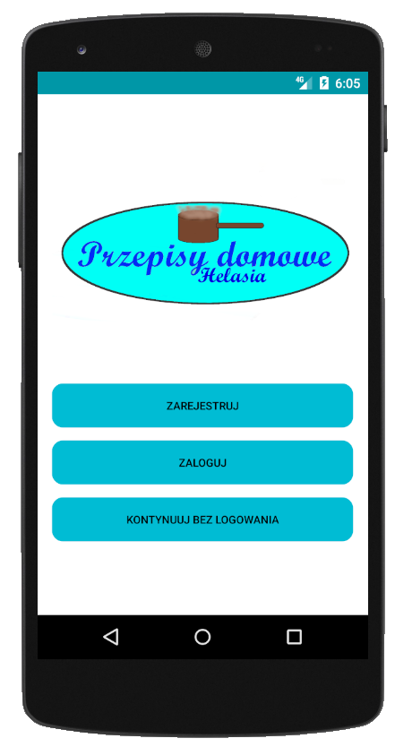
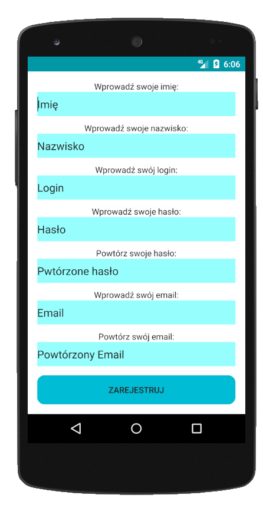
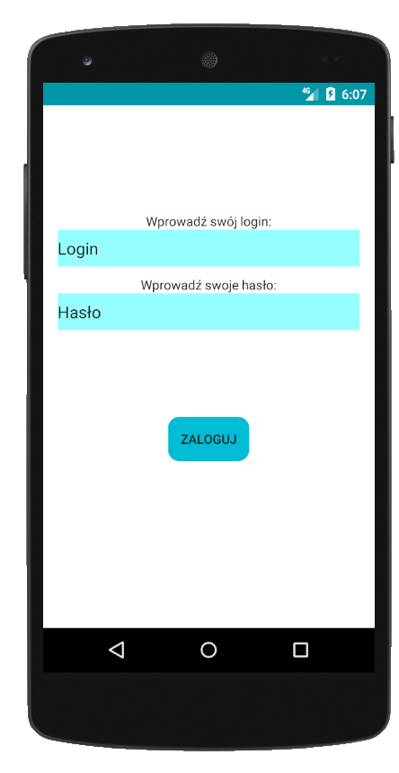
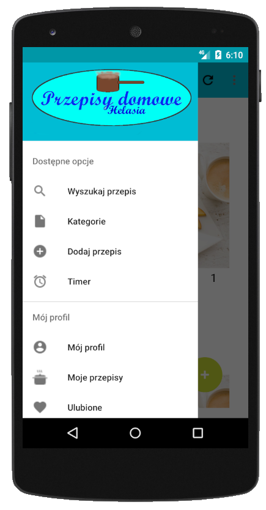
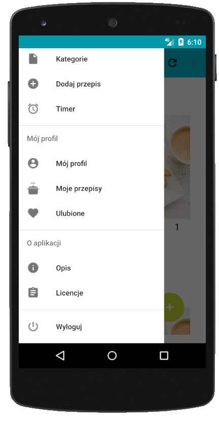
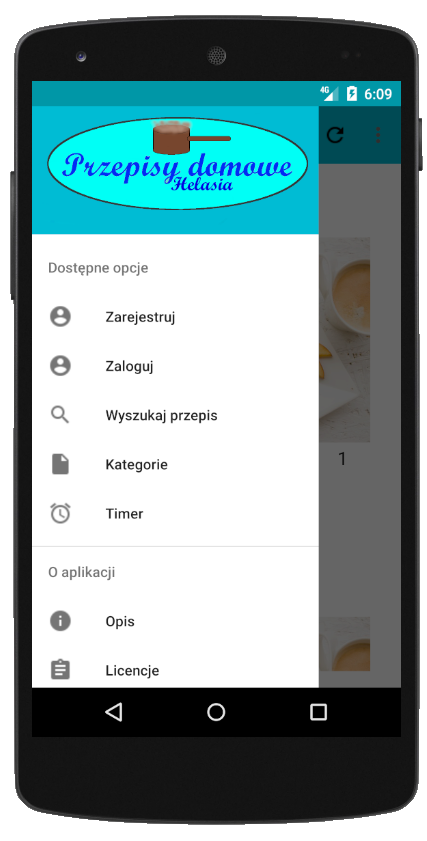
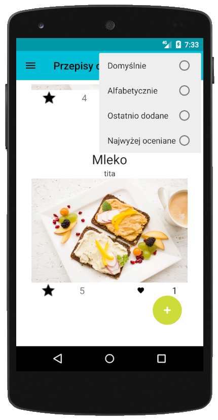
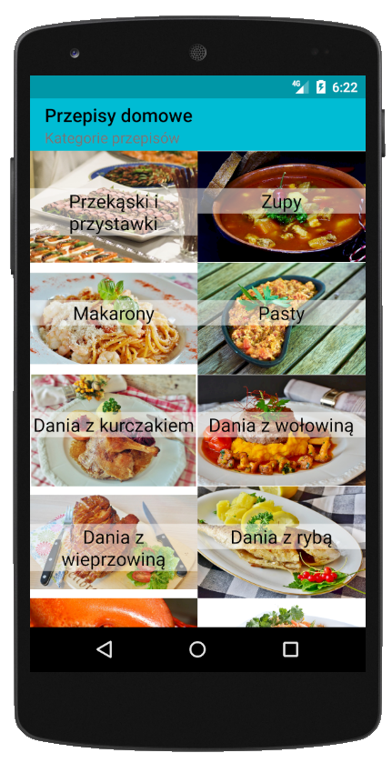
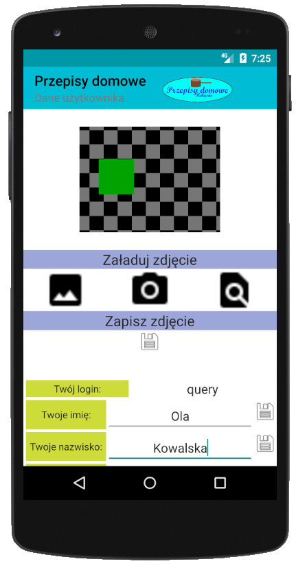
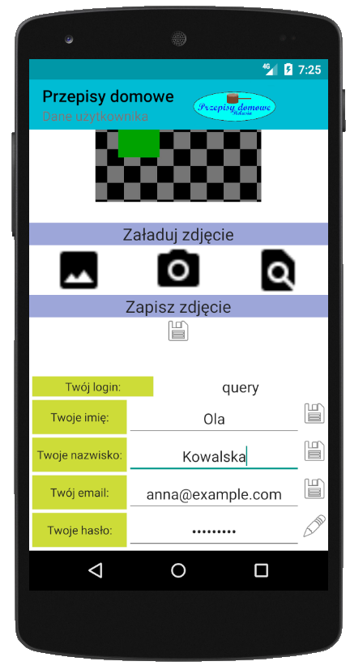
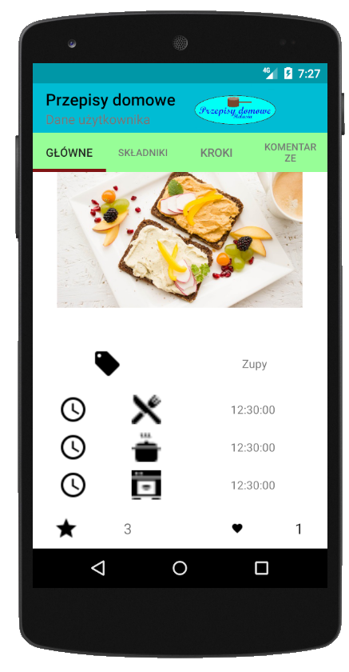

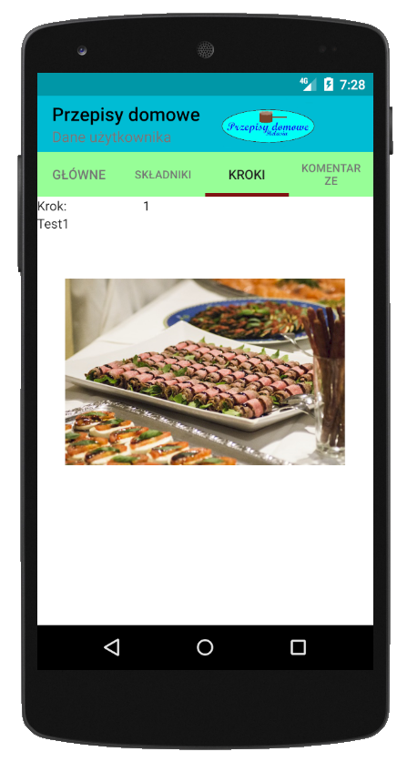
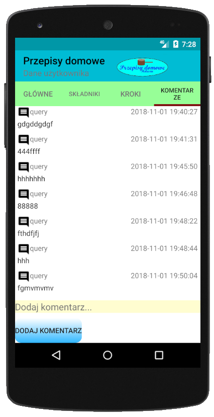
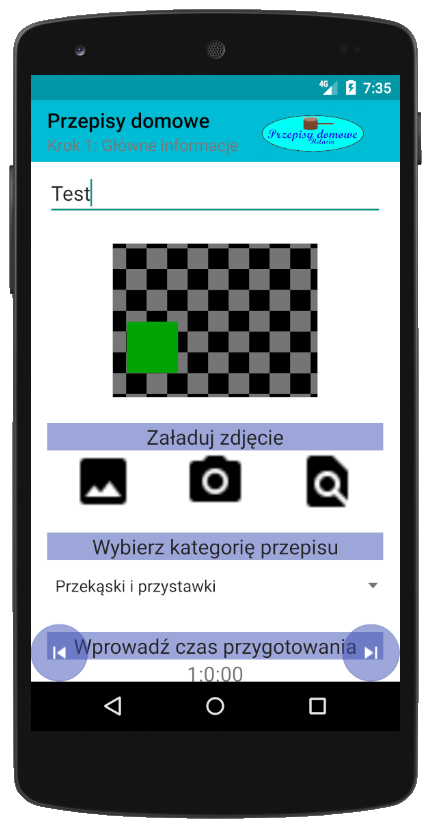
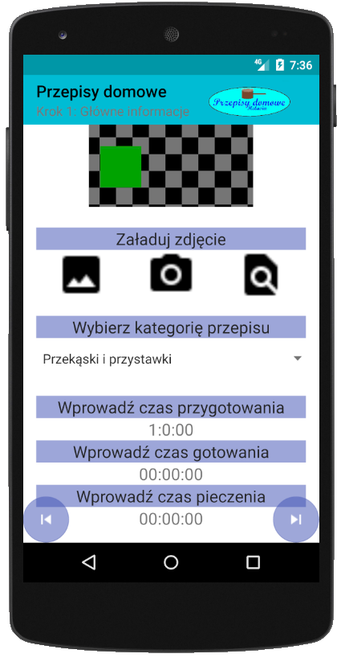
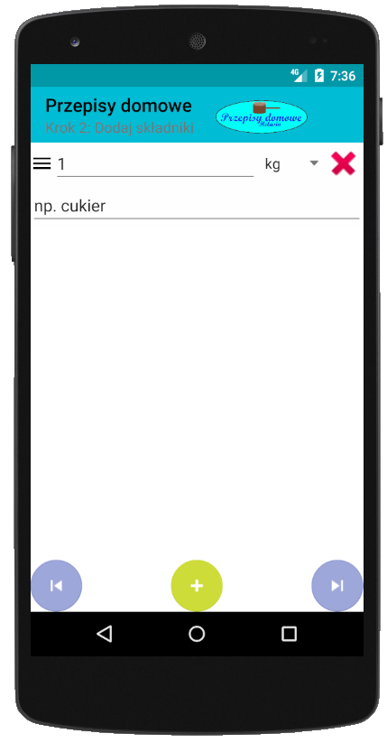
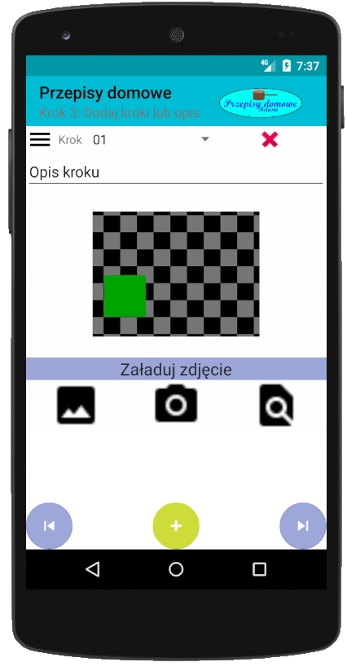
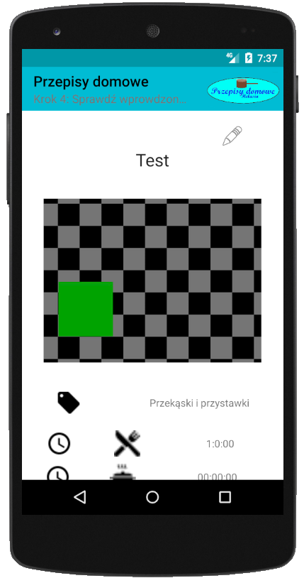
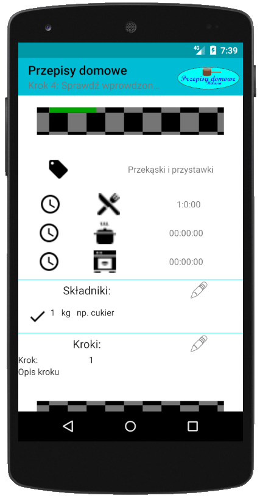
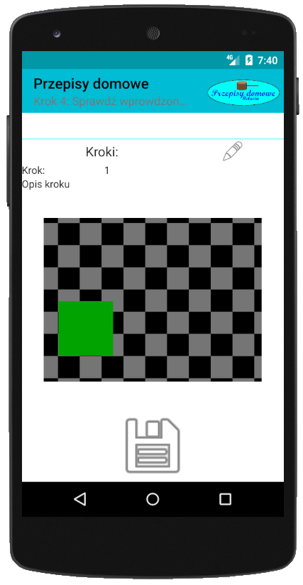

